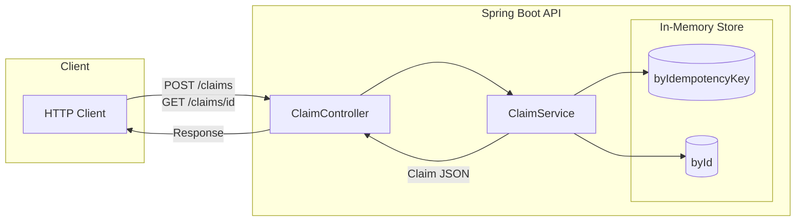
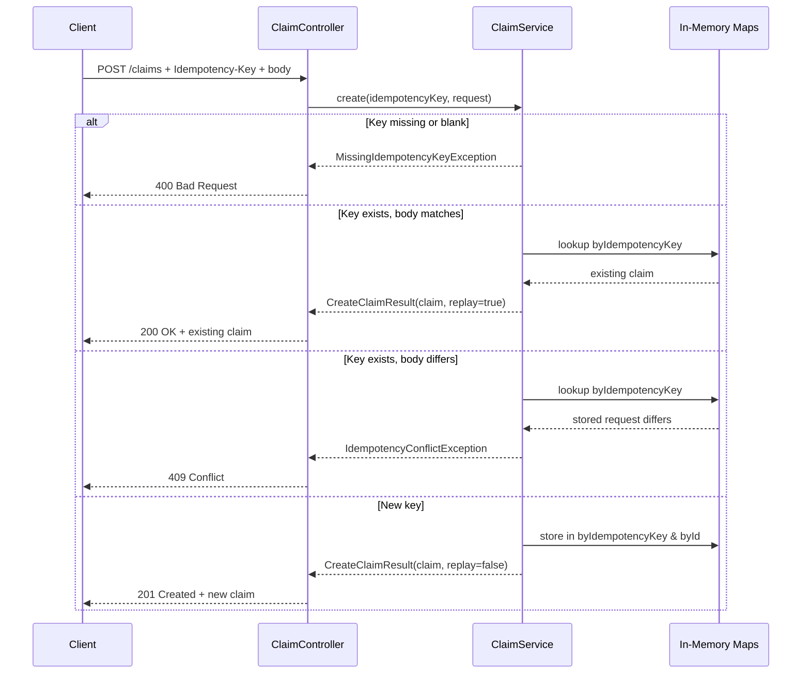
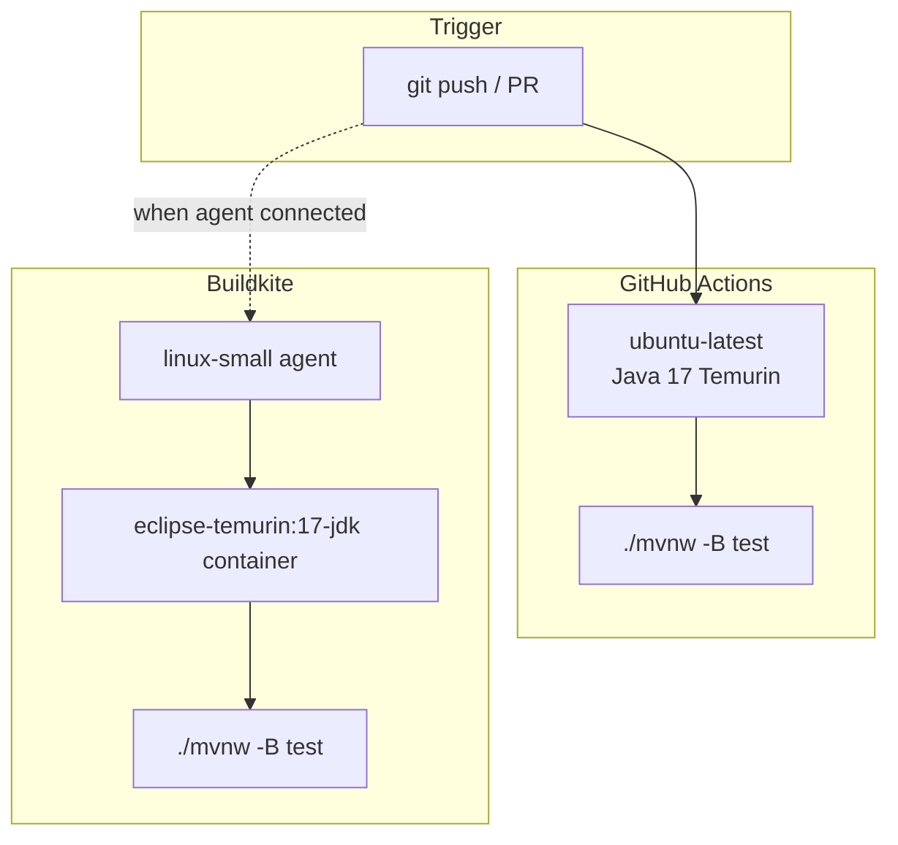

# mini-claims

Week 1 Java 17 mini-claims API for a Texas / Guidewire-prep plan. It is shaped like **Guidewire ClaimCenter Cloud API claims intake** (`POST /claims`, idempotency, claim JSON). **This is not ClaimCenter** and not a ClaimCenter install.

Author: Shashi Chin (`au.com.shashichin`).

Tonight's done bar: repo + OpenAPI + tests for `POST /claims` (failing then passing). In-memory store only. No AWS yet.

## Architecture

The API is a single Spring Boot 3.4 service exposing a REST interface for claims intake. Storage is in-memory for now.



**Packages:**
- `au.com.shashichin.miniclaims` — main app entry point
- `au.com.shashichin.miniclaims.claim` — controller, service, domain records, exceptions
- `au.com.shashichin.miniclaims.error` — global exception handler and `ApiError` response

### Request Flow: POST /claims

Every `POST /claims` requires an `Idempotency-Key` header. The service checks the key against a stored map to decide whether this is a new request, a replay, or a conflict.



### CI Pipeline

Tests run on every push and pull request via GitHub Actions. A Buildkite pipeline is also defined and ready to run when an agent is connected.



## Run

Java 17 required.

```bash
./mvnw test
./mvnw spring-boot:run
```

- Create a claim: `POST /claims` with header `Idempotency-Key` and JSON body
- Fetch a claim: `GET /claims/{claimId}`
- OpenAPI JSON: `GET /v3/api-docs`
- Swagger UI: http://localhost:8080/swagger-ui.html

### Claim JSON

```json
{
  "claimId": "generated-on-create",
  "lossDate": "2026-08-20",
  "description": "Rear-end collision at a roundabout",
  "status": "draft",
  "reporterName": "Shashi Chin"
}
```

`status` is `draft` or `open`. Omit it on create and it defaults to `draft`.

### Idempotency (`POST /claims`)

| `Idempotency-Key` | Body | Result |
| --- | --- | --- |
| missing / blank | any | `400` |
| new key | valid | `201` + `claimId` |
| same key | same body | `200` + same `claimId` |
| same key | different body | `409` |

## OpenAPI notes

springdoc-openapi serves the spec at **`GET /v3/api-docs`**. That is the machine-readable contract for this mini API (not a dumped ClaimCenter Cloud API spec). Use it to see `POST /claims`, `GET /claims/{claimId}`, the `Idempotency-Key` header, and the claim schema. Swagger UI is a convenience wrapper around the same spec.

## Tonight

Get tests green:

```bash
./mvnw test
```

The tests cover missing idempotency key, first create, replay, conflict, and GET of the created claim.

## CI

**GitHub Actions runs now** (`.github/workflows/ci.yml`: Java 17, `./mvnw -B test`).

`.buildkite/pipeline.yml` is the same Maven test step, ready when a Buildkite agent exists. It is **not** connected: there is no agent on this account yet, and this repo does not pretend otherwise.

## Next weeks (not in this repo yet)

Auth on the API, persist claims to RDS instead of the in-memory map, IAM for the app role, and a real deploy path. Week 1 stops at a green local/CI test suite.
